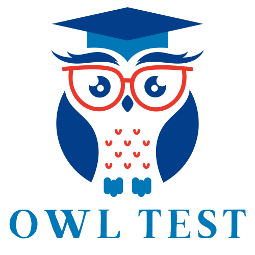

<!-- Improved compatibility of back to top link: See: https://github.com/othneildrew/Best-README-Template/pull/73 -->
<a name="readme-top"></a>

# Remote Tracking

[![GitHub contributors][contributors-shield]][contributors-url]
[![GitHub forks][forks-shield]][forks-url]
[![GitHub stars][stars-shield]][stars-url]
[![GitHub issues][issues-shield]][issues-url]

<!-- PROJECT LOGO -->
<br />
<div align="center">
  <a href="https://github.com/JacobChau/go-test-be">
    
  </a>

<h3 align="center">Remote Tracking</h3>

  <p align="center">
    A simple backend for testing purposes
    <br />
    <a href="https://github.com/JacobChau/go-test-be"><strong>Explore the docs »</strong></a>
    <br />
    <br />
    <a href="https://github.com/JacobChau/go-test-be/issues">Report Bug</a>
    ·
    <a href="https://github.com/JacobChau/go-test-be/issues">Request Feature</a>
  </p>
</div>


## Table of Contents

* [About the Project](#about-the-project)
    * [Built With](#built-with)
    * [Project Structure](#project-structure)
* [Getting Started](#getting-started)
    * [Prerequisites](#prerequisites)
    * [Installation](#installation)
* [Usage](#usage)
* [Contributing](#contributing)
* [License](#license)
* [Contact](#contact)


<!-- ABOUT THE PROJECT -->
## About The Project

[![Product Name Screen Shot][product-screenshot]](https://owl-test.onrender.com)

go-test-be is a test platform designed to streamline the process of creating, managing, and evaluating various types of tests. Whether you're a teacher looking to prepare quizzes, a company creating aptitude tests for applicants, go-test-be provides a robust backend to manage all your needs efficiently. The platform emphasizes on flexibility, ease of use, and integration capabilities, making it an ideal choice for various testing scenarios.

<p align="right">(<a href="#readme-top">back to top</a>)</p>


### Built With

* [![Laravel][Laravel.com]][Laravel-url]
* [![PostgreSQL][PostgreSQL.com]][PostgreSQL-url]
* [![Docker][Docker.com]][Docker-url]
* [![Sentry][Sentry.com]][Sentry-url]

<p align="right">(<a href="#readme-top">back to top</a>)</p>


### Project Structure
The project structure diagram provides a visual representation of the `go-test-be` application's architecture. It outlines the organization of the codebase, including the directory structure, the main components, and how they interact with each other. This diagram is especially useful for new developers or contributors to get acquainted with the project layout quickly.

#### Key Components

- **Routes:** Defined in the `routes` directory, this is where all the API endpoints are specified. Each route is linked to a specific controller method.
- **Controllers:** Controllers are responsible for handling requests and returning responses. They are located in the `app/Http/Controllers` directory.
- **Requests:** Requests are used to validate incoming requests. They are located in the `app/Http/Requests` directory.
- **Resources:** Resources are used to transform models into JSON responses. They are located in the `app/Http/Resources` directory.
- **Services:** Services are used to encapsulate business logic and are located in the `app/Services` directory.
- **Models:** Representing the application's data structure, models are found in the `app/Models` directory. They interact with the database and perform all data-related operations.
- **Database Migrations:** The `database/migrations` directory contains all the migration files that define the database schema. Migrations make it easy to modify the database structure.

- **Middleware:** Middleware are filters that get executed before and after your application handles a request. They are located in the `app/Http/Middleware` directory.

- **Tests:** All test cases are stored in the `tests` directory. This project follows TDD (Test-Driven Development), and every piece of code should have corresponding tests.

#### Directory Structure

```
[Root Directory]
│
├── app/                    # Main application directory
│   ├── Console/            # Console commands
│   ├── Exceptions/         # Exception handling
│   ├── Services/           # Business logic
│   ├── Http/               # HTTP layer of the application
│   │   ├── Requests/       # Request validation
│   │   ├── Controllers/    # Controllers for handling requests
│   │   ├── Resources/      # Resources for transforming models into JSON responses
│   │   └── Middleware/     # Middleware for filtering requests
│   └── Models/
├── bootstrap/              # Contains the application bootstrapping scripts
├── config/                 # Configuration files
|
├── database/               # Database-related files
│   ├── migrations/         # Database migrations files
│   ├── factories/          # Model factory files for testing
│   └── seeders/            # Database seeders files
│
├── public/                 # Publicly accessible files
├── resources/              # Application resources like views and assets
├── routes/                 # All the route definitions
│   ├── api.php             # Routes for API
│   └── web.ph              # Routes for web interface
│
├── storage/                # Storage directory for logs, caches, etc.
├── tests/                  # Test cases
└── vendor/                 # Composer dependencies
```

<!-- GETTING STARTED -->
## Getting Started

To get a local copy up and running, follow these simple steps.


### Prerequisites

Before you begin, ensure you have the following installed:
* PHP >= 8.0
  ```sh
  php -v
    ```
* Composer >= 2.0
  ```sh
  composer -v
    ```


### Installation

1. Clone the repo
   ```sh
   git clone https://github.com/JacobChau/go-test-be.git
   ```
2. Install Composer packages
   ```sh
   cd go-test-be
   composer install
   ```
3. Copy the .env.example file to .env and configure your environment variables
   ```sh
   cp .env.example .env
   ```
4. Generate an application key
   ```sh
    php artisan key:generate
    ```
5. Run the database migrations (and seed if you want to)
    ```sh
    php artisan migrate --seed
    ```
6. Start the development server
    ```sh
    php artisan serve
    ```
7. You're all set! Visit http://localhost:8000 to view the app.
8. (Optional) Run the tests
    ```sh
    php artisan test
    ```

<p align="right">(<a href="#readme-top">back to top</a>)</p>


<!-- USAGE EXAMPLES -->
## Usage

Use this space to show useful examples of how the project can be used. go-test-be can be leveraged to create a variety of tests:

- **Academic Tests:** Teachers can create quizzes or tests for their students, categorize them by subject, and manage them through the platform.
- **Professional Assessments:** Companies can conduct technical tests, coding assessments, or general aptitude tests for recruitment or employee evaluation.

<p align="right">(<a href="#readme-top">back to top</a>)</p>


<!-- CONTRIBUTING -->
## Contributing

Contributions are what make the open source community such an amazing place to learn, inspire, and create. Any contributions you make are **greatly appreciated**.

If you have a suggestion that would make this better, please fork the repo and create a pull request. You can also simply open an issue with the tag "enhancement".
Don't forget to give the project a star! Thanks again!

1. Fork the Project
2. Create your Feature Branch (`git checkout -b feature/AmazingFeature`)
3. Commit your Changes (`git commit -m 'Add some AmazingFeature'`)
4. Push to the Branch (`git push origin feature/AmazingFeature`)
5. Open a Pull Request

<p align="right">(<a href="#readme-top">back to top</a>)</p>


<!-- CONTACT -->
## Contact

Jacob Chau - [@facebook](https://www.facebook.com/LongUIT) - longuit2002@gmail.com

Project Link: [https://github.com/JacobChau/go-test-be](https://github.com/JacobChau/go-test-be)

<p align="right">(<a href="#readme-top">back to top</a>)</p>


<!-- MARKDOWN LINKS & IMAGES -->
<!-- https://www.markdownguide.org/basic-syntax/#reference-style-links -->
[contributors-shield]: https://img.shields.io/github/contributors/JacobChau/go-test-be.svg?style=for-the-badge
[contributors-url]: https://github.com/JacobChau/go-test-be/graphs/contributors
[forks-shield]: https://img.shields.io/github/forks/JacobChau/go-test-be.svg?style=for-the-badge
[forks-url]: https://github.com/JacobChau/go-test-be/network/members
[stars-shield]: https://img.shields.io/github/stars/JacobChau/go-test-be.svg?style=for-the-badge
[stars-url]: https://github.com/JacobChau/go-test-be/stargazers
[issues-shield]: https://img.shields.io/github/issues/JacobChau/go-test-be.svg?style=for-the-badge
[issues-url]: https://github.com/JacobChau/go-test-be/issues
[linkedin-shield]: https://img.shields.io/badge/-LinkedIn-black.svg?style=for-the-badge&logo=linkedin&colorB=555
[linkedin-url]: https://linkedin.com/in/linkedin_username
[product-screenshot]: ./public/screenshot.jpg
[Laravel.com]: https://img.shields.io/badge/Laravel-FF2D20?style=for-the-badge&logo=laravel&logoColor=white
[Laravel-url]: https://laravel.com
[PostgreSQL.com]: https://img.shields.io/badge/PostgreSQL-316192?style=for-the-badge&logo=postgresql&logoColor=white
[PostgreSQL-url]: https://www.postgresql.org
[Docker.com]: https://img.shields.io/badge/Docker-2CA5E0?style=for-the-badge&logo=docker&logoColor=white
[Docker-url]: https://www.docker.com
[Sentry.com]: https://img.shields.io/badge/Sentry-362D59?style=for-the-badge&logo=sentry&logoColor=white
[Sentry-url]: https://sentry.io
